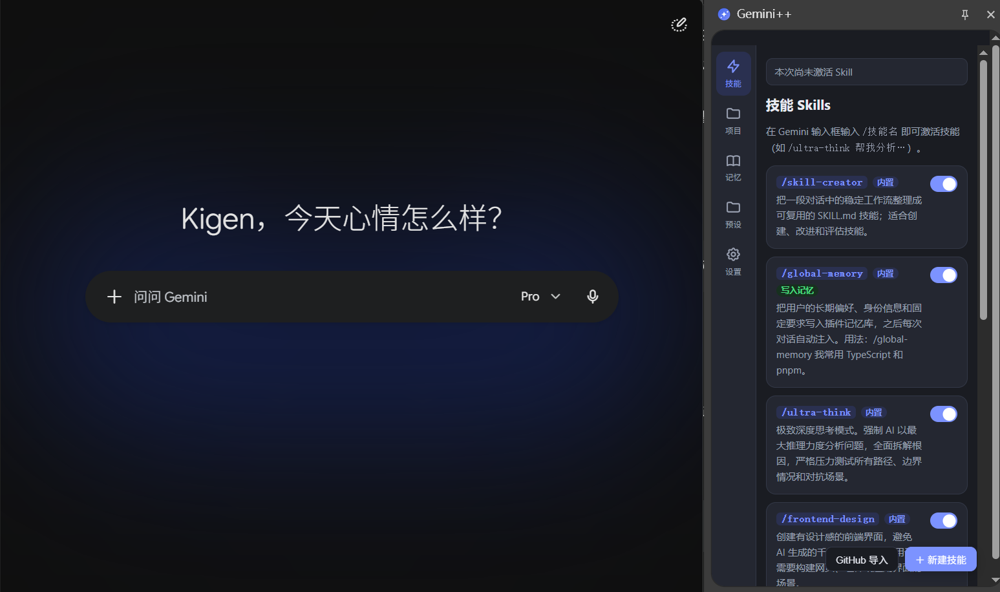
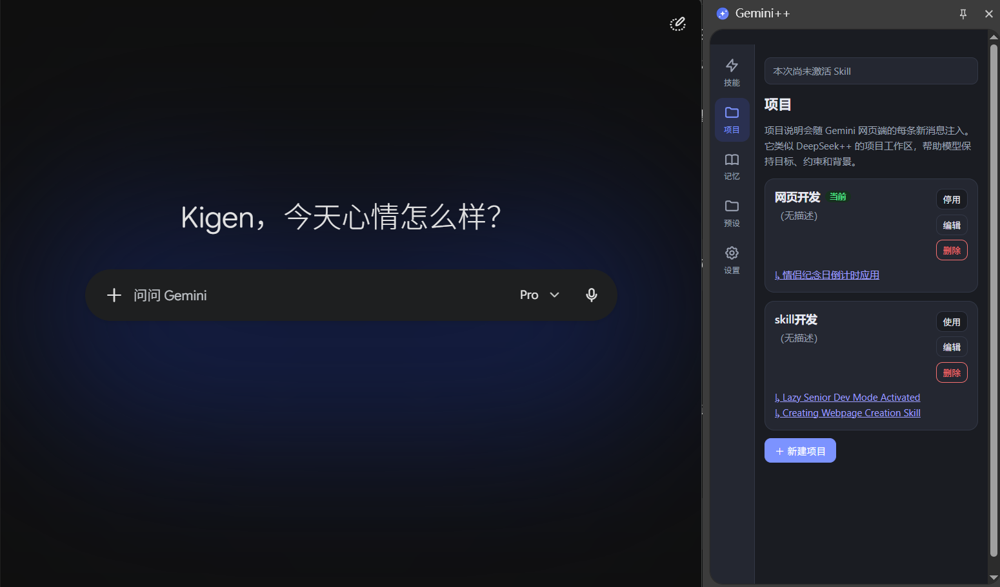
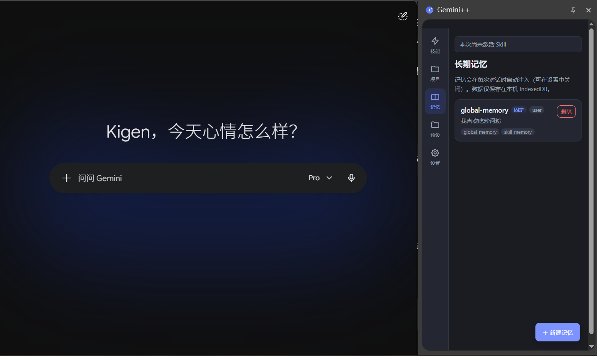
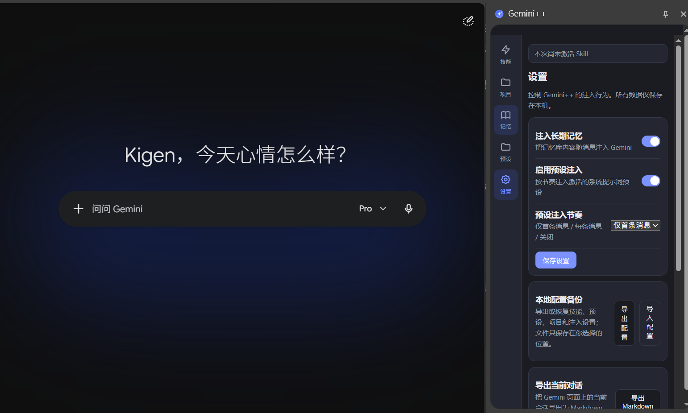

# Gemini++

> 给 Gemini 网页版加上 Skills、长期记忆、项目上下文和可控提示词注入。

把 [Gemini 网页版](https://gemini.google.com) 扩展成支持 **Skills（技能）、长期记忆、系统提示词预设与侧边栏** 的 AI 工作台浏览器扩展。

> 本项目从 [DeepSeek++](https://github.com/zhu1090093659/deepseek-pp) 学习并借鉴了整体架构思路（WXT + React + TypeScript MV3），再针对 Gemini 的页面结构和请求格式重新实现。和 DeepSeek++ 类似，Gemini++ 采用**网络层注入**：在 `MAIN` world 钩住 `fetch`/`XHR`，在发送消息的 `batchexecute` 请求体中就地增强 prompt，因此输入框气泡保持干净，不会把技能指令复述出来。

Gemini++ 将可复用技能、长期记忆、系统提示词预设和项目上下文放在浏览器本地管理，按需注入到 Gemini 请求中，不要求修改 Gemini 服务端，也不改变原有聊天界面。

## 功能

- **技能 Skills**：内置 `skill-creator`、`ultra-think`、`frontend-design`、`writing-polish`、`human-writing`、`translate-expert` 等技能；在 Gemini 输入框输入 `/技能名` 自动弹出选择面板（`/` 触发），回车选中后技能指令在网络层注入（不显示在输入框气泡里）；支持自定义技能（名称/描述/系统指令）、启用/停用、删除。模型回复完整 `SKILL.md` 时，回复下方会出现“导入为 Skill”按钮，点击后保存到本地。
- **记忆类 Skill**：名称、描述或指令包含 memory/记忆/记住/偏好等记忆语义的自定义 Skill，在调用 `/技能名 内容` 时会把内容写入侧边栏记忆，并自动固定；普通 Skill 不会写入。
- **GitHub Skill 导入**：在侧边栏「技能」页点击「GitHub 导入」，粘贴 GitHub 仓库 / 目录 / 单个 `SKILL.md` 链接（支持 `raw.githubusercontent.com`），预览仓库中的第三方 Skill 后选择导入；同源同路径重导会覆盖更新，名称冲突自动加后缀。首次导入需授予 `api.github.com` 与 `raw.githubusercontent.com` 访问权限。
- **长期记忆**：侧边栏管理记忆（类型、标题、内容、标签、固定），每次消息发送前自动注入记忆上下文；数据仅保存在本机 IndexedDB。
- **系统提示词预设**：创建多个预设，激活其一后按节奏（首条消息 / 每条消息）自动注入。
- **项目工作区**：创建项目名称、背景和约束，启用后随 Gemini 消息注入；用于复刻 DeepSeek++ 的项目上下文能力。
- **侧边栏**：点击工具栏图标或扩展图标打开，集中管理技能、记忆、预设与设置。
- **对话导出**：在侧边栏「设置」页点「导出 Markdown」，把当前 Gemini 会话抓取为 Markdown 文件下载（DOM 抓取，富文本会摊平为纯文本）。
- **设置**：开关记忆注入、预设注入、注入节奏。
- **本地配置备份**：在设置中导出或导入技能、预设、项目和注入设置 JSON；导入时可选择覆盖或合并。

## 界面预览

### Skills 技能

输入 `/技能名` 即可激活技能，也可以启用内置技能或管理自定义 Skill。



### 项目工作区

项目可以保存独立的背景、约束和相关技能，随对话注入 Gemini。



### 长期记忆

长期记忆保存在本机 IndexedDB，并可固定、删除和按标签管理。



### 注入设置与配置备份

可以控制记忆、预设的注入行为，并导出或导入本地配置。



## 隐私与数据

- 技能、记忆、预设和项目数据默认保存在本机 IndexedDB / `chrome.storage` 中。
- 扩展没有配套后端服务，不会把这些配置上传到 Gemini++ 服务器。
- 使用 GitHub Skill 导入时，浏览器会直接访问 GitHub API 和 raw 内容地址，首次使用需要授予相应权限。

## 安装（开发模式）

1. 克隆仓库并安装依赖：

```powershell
git clone https://github.com/KigenJaeger/Geminiplusplus.git
cd Geminiplusplus
npm install
npm run build:chrome
```

2. 打开 Chrome / Edge，进入 `chrome://extensions`（Edge 为 `edge://extensions`）。
3. 打开右上角「开发者模式」。
4. 点击「加载已解压的扩展程序」，选择项目下生成的 `dist/chrome-mv3` 目录。

开发调试可运行 `npm run dev`，构建 Edge 版本可运行 `npm run build:edge`。

## 使用

1. 打开 https://gemini.google.com 并登录。
2. 在侧边栏创建记忆 / 技能 / 预设；也可以点「GitHub 导入」从 GitHub 仓库导入第三方 Skill。
3. 在 Gemini 输入框输入 `/ultra-think 帮我分析这个问题…`，回车后 Gemini++ 会自动把技能指令注入并发送。
4. 激活的预设与记忆会按设置自动注入。

## 技术说明

- 框架：WXT + React 19 + TypeScript（MV3），与 DeepSeek++ 同栈。
- 架构：`content script`（ISOLATED world：读注入数据、`/` 技能面板、推送快照与输入框文本、对话导出）↔ `gemini-main-world.content`（MAIN world：钩 `fetch`/`XHR`，在 `batchexecute` 请求体里按值替换 prompt）↔ `background`（集中存储：IndexedDB 记忆 / chrome.storage 技能·预设·设置）↔ `sidepanel`（React UI）。两个 world 通过 `window.postMessage` 桥接（`core/gemini/bridge.ts`）。
- 存储作用域：记忆在扩展上下文的 IndexedDB（`GeminiPP`），与 Gemini 页面数据隔离。
- 注入格式：在网络层把请求体里的用户原文替换为【Gemini++ 系统规则】块 + 技能指令 / 记忆 / 预设 + "用户问题"前缀 + 你的原文。规则块会要求模型不提及、不复述注入内容，也不以代码注释或元标记形式输出，避免污染回答。因为改写发生在请求体、不改输入框，消息气泡保持干净。

## 已知限制

- 依赖 Gemini 页面的 DOM（`rich-textarea` / `.ql-editor` 等）与 `batchexecute` 请求体结构；Gemini 大版本更新后可能需要更新 `core/gemini/composer.ts`、`core/gemini/batch-codec.ts` 与 `entrypoints/*.content.ts`。
- 网络层注入按「输入框原文」在请求体里查找替换：若原文找不到（例如 Gemini 改了发送编码），则原样发送、不注入也不破坏请求。多行输入的换行在 contenteditable 与请求体里可能表示不同，极端情况下可能匹配不到。
- 对话导出为 DOM 抓取：富文本（代码块、表格、图片）会被摊平为纯文本；刷新页面后从服务器加载的历史，可能显示完整的注入文本。

## 开发与测试

```powershell
npm run compile
npm test
```

## License

Apache-2.0
